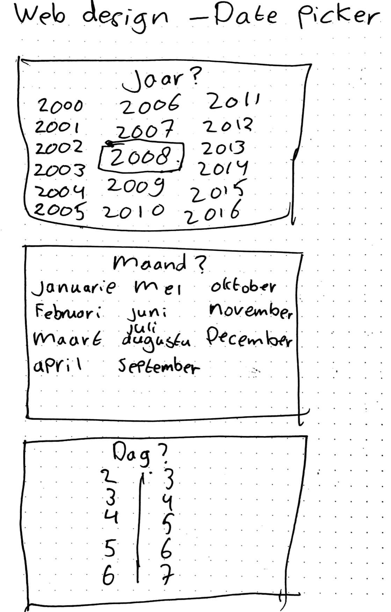
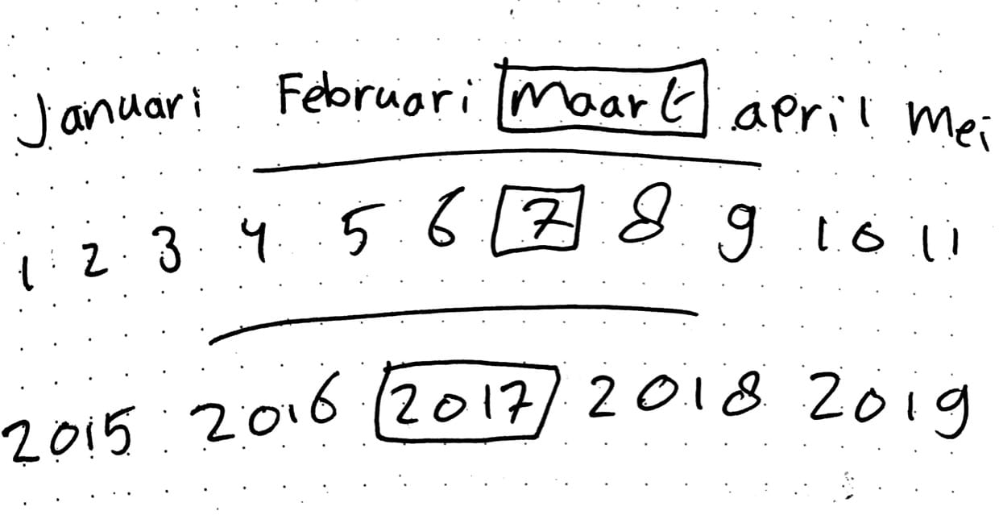
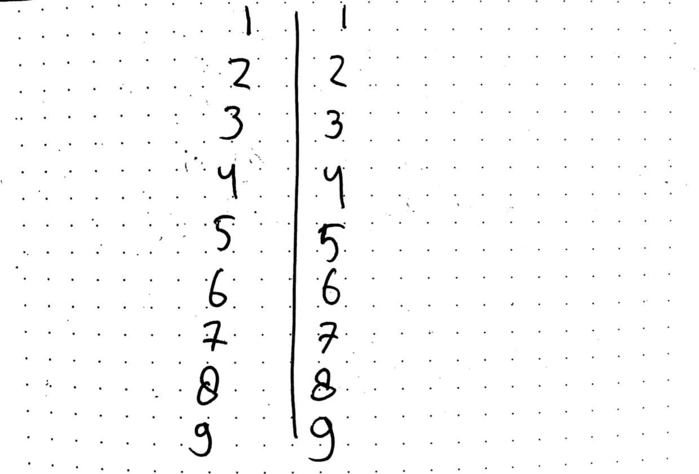
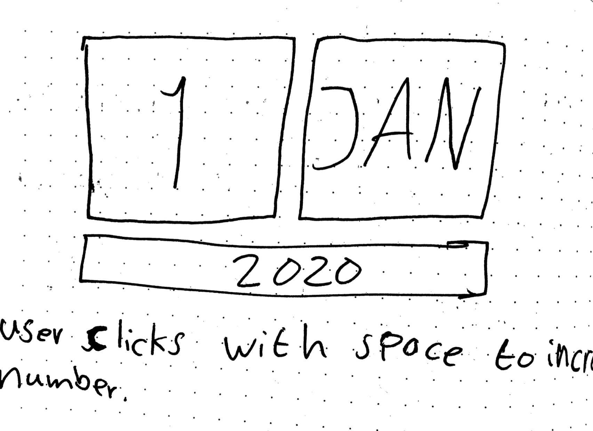
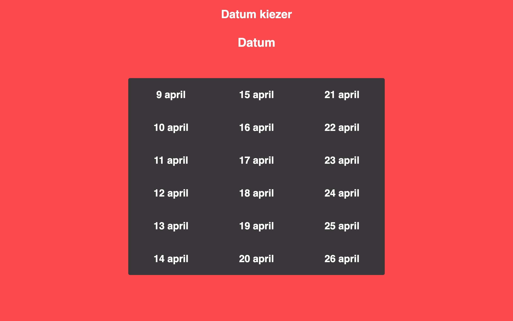
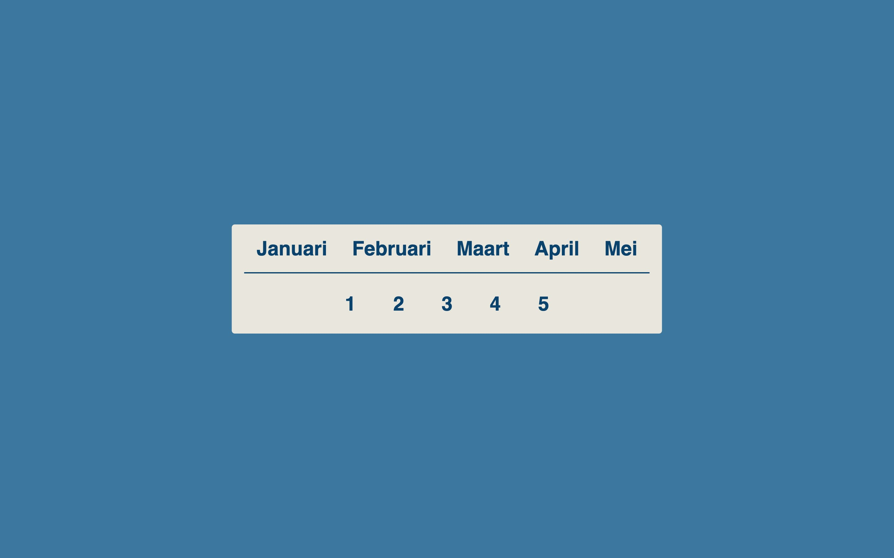
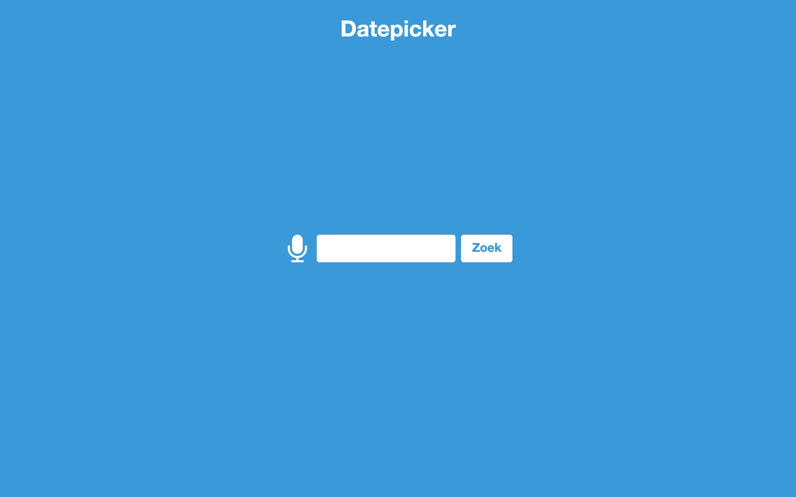
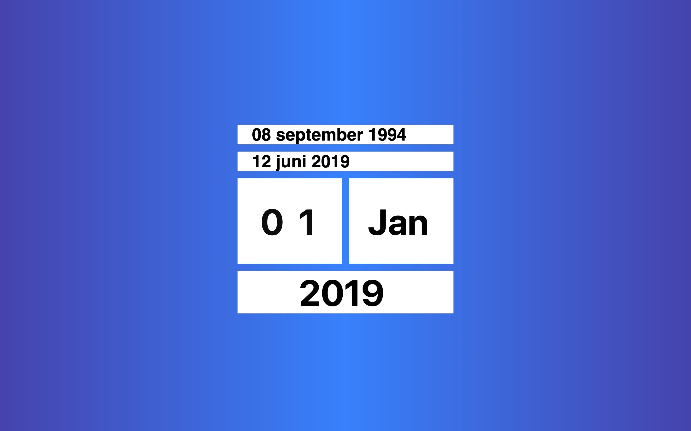
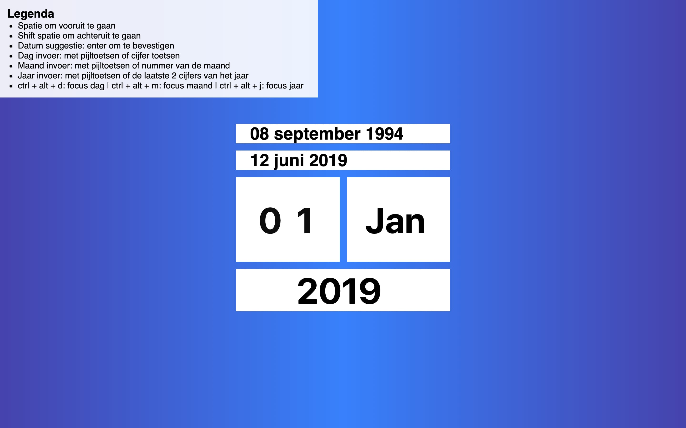

# Web Design project

[Link naar concept demo](https://laughing-bhaskara-7296a9.netlify.com/)

## Inhoudsopgave
1. [Marijn de gebruiker](#1-Marijn-de-gebruiker)
2. [Opdracht](#2-Opdracht)
3. [Onderzoek motorische stoornis](#3-Onderzoek-motorische-stoornis)
4. [Aannames over Marijn](#4-Aannames-over-Marijn)
5. [Gesprek 1](#5-Gesprek-1)
6. [Papieren schetsen](#6-Papieren-schetsen)
7. [Demo versies](#7-Demo-versies)
8. [Feedback van leraar](#8-Feedback-van-leraar)
9. [Concept](#9-Concept)
10. [Testplan](#10-Testplan)
11. [Gesprek 2](#11-Gesprek-2)
12. [Verbeterpunten](#12-Verbeterpunten)
13. [Gesprek 3](#13-Gesprek-3)
14. [Exclusive Design Principles](#14-Exclusive-Design-Principles)
15. [Nieuwe iteratie](#15-Nieuwe-iteratie)

## 1. Marijn de gebruiker
Ik werk een opdracht uit voor mijn testgebruiker Marijn. Marijn heeft een motorische stoornis en is daardoor niet in staat om een muis te gebruiken.

## 2. Opdracht
Ontwerp een date picker voor Marijn.
Hij reist veel met de trein, en hij moet van tevoren aangeven welke trein hij wil nemen zodat er iemand is om hem te helpen met zijn rolstoel. Date-pickers zijn over het algemeen priegelig, en niet ontworpen voor iemand die afhankelijk is van zijn toetsenbord?

## 3. Onderzoek motorische stoornis
Wanneer een kind een motorische achterstand heeft kan dit duiden op dyspraxie of DCD (Development Co-ordination Disorder), in het Nederlands, stoornis in de ontwikkeling van de coördinatie van bewegingen.

Kenmerken die we dan zien zijn: een houterige beweging, moeite met het doseren van kracht (b.v. veel te hard of zacht gooien met een bal), problemen met het starten of stoppen van een beweging op het juiste moment, trillen bij de aanzet tot een beweging, snel verlies van het evenwicht, moeilijk leesbaar handschrift, moeite met tijdsdruk en tragere verwerking van visuele informatie. Maar dyspraxie/ DCD kent vele verschijningsvormen en bij ieder kind kunnen weer andere kenmerken waargenomen worden. Bij het ene kind ligt het probleem vooral bij de taalontwikkeling bij het andere in de grove motoriek terwijl het derde kind juist moeite heeft met de fijne motoriek en een vierde zich vooral slecht kan concentreren. Dit maakt het moeilijker om de diagnose dyspraxie / DCD te stellen.

## 4. Aannames over Marijn
Omdat elk persoon met een motorisch stoornis, andere symptomen heeft, maak ik hier aannames over Marijn.
- Is niet in staat om een muis te gebruiken
- Gebruikt een toetsenbord met grote knoppen
- Is in staat om relatief normaal te praten. Dus een oplossing met spraak zou kunnen.
- Houd niet van effecten en animaties

### Vragen voor Marijn
1. Hoe navigeer je het internet?
2. Zou een spraak oplossing je helpen?
3. Heb je een aangepast toetsenbord die je gebruikt?
4. Kun je website voorbeelden noemen die je makkelijk kunt gebruiken?

## 5. Gesprek 1
In de eerste week had Marijn jammer genoeg geen tijd om langs te komen. Hierdoor heeft de leraar alle vragen zo goed mogelijk beantwoordt.

### Antwoorden van leraar
1. Marijn gebruikt de tab toets, sticky keys en de enter toets om te navigeren.
2. Een spraak oplossing gaat niet werken omdat Marijn moeite heeft om duidelijk te praten.
3. Marijn gebruikt gewoon een standaard (MacBook) toetsenbord.
4. Geen antwoord op vanwege afwezigheid.

### Over Marijn
- Gebruikt sticky keys
- Gebruikt 1 hand (linkerhand)
- Moeite met motoriek
- Optillen van hand heeft hij moeite mee
- Moeite met praten

Meer heb ik helaas niet kunnen noteren omdat hij niet aanwezig kon zijn.

## 6. Papieren schetsen
Voordat ik digitale versies ging maken, ben ik eerst gaan schetsen op papier.





## 7. Demo versies
### Demo 1
In deze demo zijn de dagen, maanden en jaren los van elkaar getrokken. Deze data is groot in beeld gebracht zodat het makkelijk te lezen is. Hier kun je met de tab toets en de pijltoetsen doorheen navigeren.
Omdat het een demo versie is, is alleen het jaar laten zien, maar de maanden en dagen zouden op dezelfde manier eruit zien.


### Demo 2
Deze versie is uitgewerkt van demo 1. Het is op een andere manier vormgegeven om te testen wat fijner werkt voor Marijn. Hier zijn de maanden en dagen losgekoppeld en kun je beide data appart selecteren.


### Demo 3
Hier heb ik geprobeerd om te werken met spraak naar tekst. Ik had deze demo gemaakt voordat ik wist dat Marijn moeite had met praten. Deze oplossing zou hem niet kunnen helpen.


## 8. Feedback van leraar
Mooie demo's. Sommige demo's werken wel voor het een doelstelling maar de andere weer moeilijker. Spraak herkenning gaat jammer genoeg niet werken.

Kijk eens naar datepicker suggesties, wat kun je daarmee doen voor Marijn. Input velden voor een naam bijvoorbeeld geven vaak al een suggesties om je naam daar automatisch in te voeren of je adres, maar bij een datepicker is dat vaak nog niet het geval.

En hoe zou een range selector werken met een toetsenbord?

## 9. Concept
Ik ga verder met de datepicker om daar een oplossing voor te bedenken die Marijn kan helpen als hij een datum moet invoeren. Ik wil een demo maken voor een datepicker, die suggesties geeft op basis wat je eerder hebt ingevoerd en ook een optie voor je geboortedatum. Mocht de juiste suggestie er niet tussen staan, dan kun je altijd zelf de gewenste datum invullen. Dit moet dan wel op een manier gebeuren dat het makkelijk kan met een toetsenbord.

Versie 1 van de datepicker


## 10. Testplan
### User scenario
Marijn heeft een motorische stoornis en gebruikt het web met zijn toetsenbord. Nu wil Marijn naar Amsterdam gaan met de trein, maar daar heb je een OV chipkaart voor nodig. Gelukkig kun je heel gemakkelijk een OV chipkaart aanvragen online. Marijn heeft al veel moeite om tot de aanvraag scherm te komen op de website van OV Chipkaart. Uiteindelijk moet hij ook zijn geboortedatum invullen. Maar hier heeft hij veel moeite mee aangezien het allemaal op de juiste manier ingevuld moet worden. Het zou voor Marijn heel makkelijk zijn als hij dit met zijn toetsenbord in kon vullen.

Nu is er een datepicker die je heel makkelijk met je toetsenbord kan invullen en die ook suggesties geeft op basis wat je eerder op andere websites hebt ingevuld. Heb je bijvoorbeeld bij de belastingsdienst een datum ingevuld, dan komt diezelfde datum ook als suggestie bij de datepicker te staan.

## 11. Gesprek 2
Tijdens de test heb ik genoteerd wat mij opgevallen is aan Marijn:
- Gebruikt de spatiebalk om te scrollen
- Gebruikt zijn trackpad ook maar weinig
- Wil graag zo weinig mogelijk toetsen indrukken
- Elementen dicht bij elkaar is fijner
- Kan zijn tab toetsen gebruiken maar liever niet

### Wat wil ik testen?
1. Invullen van een datum zonder suggesties
2. Invullen van een datum met een suggestie
3. Navigatie met het toetsenbord
4. Acces keys
5. Zou deze oplossing je helpen met een datepicker

Tijdens mijn demo test, heb ik het volgende opgeschreven om te verbeteren:
1. Je kunt teveel cijfers invullen bij de dagen
2. Cijfer van de maand indrukken zodat die geselecteerd word
3. Kijken naar de jaar zodat die makkelijker wordt

Het invullen van een datum met of zonder suggestie gaat best goed. Het navigeren met de toetsenbord gaat ook prima op sommigen punten na. Ik heb nog niet kunnen laten testen om acces keys te testen. Deze laat ik erin staan en laat ik hem volgende keer proberen.

## 12. Verbeterpunten
1. Ik heb een JavaScript functie geschreven die ervoor zorgt dat je maar 1 cijfer kunt invullen per input veld. Er bestaat ook iets als maxlength als HTML attribute, maar deze werkt alleen voor de input type text en niet voor number die ik heb gebruikt.

```javascript
function maxInput() {
	if (this.value.length > 1) {
		this.value = this.value.slice(0, 1);
	}
}
```

2. Ik heb eraan toegevoegd dat wanneer je focus hebt op de maand dropdown, dat je vervolgens het cijfer van de maand kunt klikken op de toetsenbord waar die vervolgens de juiste maand selecteerd.

```javascript
if (activeElement === month) {
	if (parseInt(number) > 0 && parseInt(number) < 10) {
		if (keys.length === 0) {
			keys.push(number);
			const selectedMonth = keys[0];
			while (keys.length > 0) keys.pop();
			month.querySelectorAll('option').forEach(function (option) {
				if (selectedMonth === parseInt(option.value)) {
					option.selected = true;
				}
			});
		}
	}
}
```
 
3. De jaar input heb ik verbeterd door de input te veranderen naar een dropdown. Door dit te doen kon ik een functie schrijven die het mogelijk maakt dat je maar 2 cijfers hoeft in te vullen om een jaar te selecteren. Dus als je 1970 wilt hebben, dan hoef je alleen maar de 7 en de 0 in te voeren. De code komt hetzelfde op neer als van de maand die hierboven beschreven staat, alleen ik sla beide keystrokes op om die vervolgens later samen te voegen.

4. Als idee kreeg ik om een num lock key functionaliteit te maken. Op laptop toetsenborden zijn de num lock keys er meestal eraf gehaald door ruimtegbrek. Dus daarom heb een functie gemaakt die ervoor zorgt dat je de volgende letters kunt gebruiken om een cijfer in te voeren: z: 0, x: 1, c: 2, v: 3, a: 4, s: 5, d: 6, q: 7, w: 8, e: 9.
Op deze manier kun je zowel de dagen als de dropdown mee selecteren.

5. Al met al is er best wat toegevoegd aan de datepicker. Om een overzichtje te maken heb ik een legenda geplaatst waar alle shortcuts in genoteerd staan.

Versie 2 van de datepicker
Deze versie is visueel niet veel veranderd ten opzichte van versie 1. Maar qua functionaliteit is er veel aan toegevoegd.


## 13. Gesprek 3
### Wat wil ik testen?
1. Accesskeys
2. Num locks keys
3. Invullen van maanden met toetsenbord
4. Invullen van jaar met toetsenbord
5. Naar de volgende element gaat met de spatiebalk

### Validatie
Ik heb het volgende kunnen testen met Marijn.
1. Access keys vond hij niet zo fijn omdat je veel toetsen moest drukken om ergens te komen. Liever handmatig naar de plek toegaan.
2. De num lock keys zaten een beetje te dicht op elkaar.
3. Met het invoeren van de maanden had ik nog een bug dat je geen oktober, november en december kon invoeren. Dit is omdat deze maanden 2 cijfers hebben. Dit had Marijn al gelijk ontdekt bij het testen van mijn app. Dit kan ik aanpassen door andere keys als 10 enzovoort te laten worden.
4. Het jaar invoer ging nu makkelijker doordat je maar 2 cijfers in hoefden te voeren in plaats van 4.

### Wat heb ik nog meer genoteerd
Mij is nog een paar dingen opgevallen over Marijn.
- Marijn wil het liefst de enter toets gebruiken om iets te bevestigen in plaatsen een andere key.
- Als Marijn de w a s d toetsen gebruikt om te navigeren, dan zou hij het liefst de tab key willen gebruiken omdat die dichter bij de w a s d toetsen zitten.

## 14. Exclusive Design Principles
### Study situation
In het project bestuderen we Marijn die een motorische stoornis heeft. We bestuderen hem over hoe hij zijn computer, het web en vooral hoe hij onze applicatie gebruikt. Hij was twee van de drie keer beschikbaar voor een sessie om te testen. De eerste keer had hij jammer genoeg geen tijd. De eerste keer toen Marijn kwam, konden we onze ideeën testen waar we feedback op kregen. De laatste keer dat hij komt, kunnen we de feedback die we toegepast hebben valideren om te controleren of we het zo goed gedaan hebben.

Marijn heeft moeite met en gebruik:
- Gebruikt sticky keys
- Gebruikt 1 hand (linkerhand)
- Moeite met motoriek
- Optillen van hand heeft hij moeite mee
- Moeite met praten
- Gebruikt de spatiebalk
- Gebruikt zijn trackpad ook maar weinig
- Wil graag zo weinig mogelijk toetsen indrukken

Deze punten zijn er uit mijn onderzoek uitgekomen. Met deze punten heb ik ook rekening mee gehouden tijdens het ontwerpen van mijn ontwerp.

### Ignore conventions
Zoveel mogelijk conventies negeren die je normaal zou gebruiken. Iets nieuws proberen te maken met puur HTML, CSS en JavaScript. Zeker als je gaat ontwerpen voor 1 gebruiker, dan hoef je alleen maar iets te maken wat voor hem werkt.

Ik heb daarom geprobeerd zoveel mogelijk conventies te verwijderen en zoveel mogelijk zelf te maken.
- Voor de dagen en maanden heb ik niet de standaard input type gebruikt om die te kunnen selecteren. Ik heb mijn eigen datepicker gemaakt met CSS en JavaScript. Om zo nog een betere applicatie te maken die hij kan gebruiken.
- De dagen input zijn los getrokken van elkaar. Nu heb je 2 input velden waarbij eerste input tot en met de 3 gaat en de tweede input gaat tot en met de 9. Zo kun 1 tot en met 31 selecterd door maar heel weinig te klikken. Normaal als je dag 22 nodig hebt, zou je 22 keer op de pijltoets moet klikken. Nu klik je 2x op pijl naar boven, tab, en 2x op de laatste input.
- Voor nog snellere selectie van een datum, maak ik gebruik van suggesties. Boven de datepicker staan er een paar suggesties en zodra je daarop klikt veranderd de datepicker met de datum van de suggestie.

### Prioritise identity
Focussen voor 1 specifieke gebruiker. Het maken van een functie die het handig maakt voor die gebruiker. Voor het gesprek heb ik iets gemaakt waarvan ik dacht dat het hem zou helpen. Tijdens het gesprek ben ik erachter gekomen dat er nog meer functies zijn die toegevoegd kunnen worden om het handiger te maken.

- Je kunt het cijfer van de maand klikken en de juiste maand wordt geselecteerd in de dropdown.
- Om het makkelijker te maken om een jaar in te vullen, hoef je alleen de laatste 2 cijfers van het jaar in te voeren om een jaar te selecteren.
- Voor Marijn is het lastig als hij van de ene kant naar de andere kant van het toetsenbord moet. Daarom heb ik num lock keys toegevoegd op de letters.
- Ik heb access keys gebruikt om snel te wisselen van de dagen, maand en jaar input velden.

### Add nonsense
Het toevoegen van functies die misschien helemaal niet nodig zijn. Om zo misschien erachter te komen dat die functies verder uitgebouwd kunnen worden tot iets wat wel handig is.

Nu heb ik toegevoegd dat wanneer je focust op de dagen, maand of jaar input velden. Dat je een blink animatie krijgt die op een neer gaat.

## Nieuwe iteratie
Tijdens de beoordeling was mijn proces en uitslag nog niet goed genoeg. Hierbij beschrijf ik wat ik gedaan heb om mijn project te verbeteren.

### User scenario
Marijn heeft een motorische stoornis en gebruikt het web met een toetsenbord. Marijn heeft moeite met fijne motoriek en moet zo zijn computer gebruiker wat voor hem fijn is.
Datepickers heeft Marijn moeite mee. Als hij datums moet invullen in zijn agenda, of op het internet zal dat even duren voordat hij bij de juiste datum is.
Marijn moet bij de gemeente de geboortedatums invullen van al zijn mede bewoners. Dit kost voor iemand die geen motorische stoornis heeft al wat moeite omdat je ver terug moet. Maar voor Marijn zal dit nog meer last bezorgen omdat hij daarmee nog langzamer is.
Nu is er een datepicker waar standaard al de geboortedatums instaan van zijn dierbare personen. Maar hier staan ook datums in die hij vaak moet invullen of die hij zojuist ergens anders heeft ingevuld.


Met deze user scenario ben ik opnieuw gaan kijken naar de huidige datepicker.

### Aanpassingen die ik doorgevoerd heb
Om meer identiteit te geven aan de datepicker.
- Uitstraling aangepast
- Je krijgt verschillende achtergrond te zien gebaseerd op de datum suggestie die je aanklikt
- Ook krijg je gebaseerd op de datum, een ander geluid effect te horen als je op toevoegen aan kalendar klikt
- Wanneer er fout ingetypt wordt, krijg je een persoonlijk melding
- Legende optioneel gemaakt met een checkbox
- Meer datum suggesties met persoonlijke datums

### Exclusive Design Principles
#### Study situation
In het project bestuderen we Marijn die een motorische stoornis heeft. We bestuderen hem over hoe hij zijn computer, het web en vooral hoe hij onze applicatie gebruikt. Hij was twee van de drie keer beschikbaar voor een sessie om te testen. De eerste keer had hij jammer genoeg geen tijd. De eerste keer toen Marijn kwam, konden we onze ideeën testen waar we feedback op kregen. De laatste keer dat hij komt, kunnen we de feedback die we toegepast hebben valideren om te controleren of we het zo goed gedaan hebben.

Marijn heeft moeite met en gebruik:
- Gebruikt sticky keys
- Gebruikt 1 hand (linkerhand)
- Moeite met motoriek
- Optillen van hand heeft hij moeite mee
- Moeite met praten
- Gebruikt de spatiebalk
- Gebruikt zijn trackpad ook maar weinig
- Wil graag zo weinig mogelijk toetsen indrukken

Deze punten zijn er uit mijn onderzoek uitgekomen. Met deze punten heb ik ook rekening mee gehouden tijdens het ontwerpen van mijn ontwerp.

#### Ignore conventions
Zoveel mogelijk conventies negeren die je normaal zou gebruiken. Iets nieuws proberen te maken met puur HTML, CSS en JavaScript. Zeker als je gaat ontwerpen voor 1 gebruiker, dan hoef je alleen maar iets te maken wat voor hem werkt.

Ik heb daarom geprobeerd zoveel mogelijk conventies te verwijderen en zoveel mogelijk zelf te maken.
- Voor de dagen en maanden heb ik niet de standaard input type gebruikt om die te kunnen selecteren. Ik heb mijn eigen datepicker gemaakt met CSS en JavaScript. Om zo nog een betere applicatie te maken die hij kan gebruiken.
- De dagen input zijn los getrokken van elkaar. Nu heb je 2 input velden waarbij eerste input tot en met de 3 gaat en de tweede input gaat tot en met de 9. Zo kun 1 tot en met 31 selecterd door maar heel weinig te klikken. Normaal als je dag 22 nodig hebt, zou je 22 keer op de pijltoets moet klikken. Nu klik je 2x op pijl naar boven, tab, en 2x op de laatste input.
- Voor nog snellere selectie van een datum, maak ik gebruik van suggesties. Boven de datepicker staan er een paar suggesties en zodra je daarop klikt veranderd de datepicker met de datum van de suggestie.

#### Prioritise identity
Focussen voor 1 specifieke gebruiker. Het maken van een functie die het handig maakt voor die gebruiker. Voor het gesprek heb ik iets gemaakt waarvan ik dacht dat het hem zou helpen. Tijdens het gesprek ben ik erachter gekomen dat er nog meer functies zijn die toegevoegd kunnen worden om het handiger te maken.

Ik heb de identiteit van Marijn doorgevoerd in de app.
Zo heb ik specfieke achtergrond die bij Marijn passen erin gezet, heb ik meer datum suggesties geplaatst die voor Marijn heel nuttig zijn en wordt er een melding getoond als Marijn de datum verkeerd intypt.

#### Add nonsense
Het toevoegen van functies die misschien helemaal niet nodig zijn. Om zo misschien erachter te komen dat die functies verder uitgebouwd kunnen worden tot iets wat wel handig is.

Om nonsense aan de app toe te voegen, speel ik speciale geluidseffecten af wanneer Marijn op de add calendar button klikt. De geluidseffecten zijn niet nodig voor de functionaliteit, maar brengen weer meer karakter met zich mee.